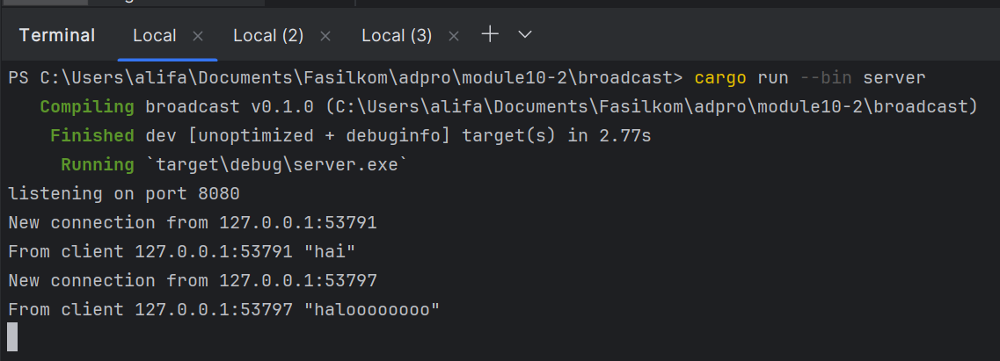
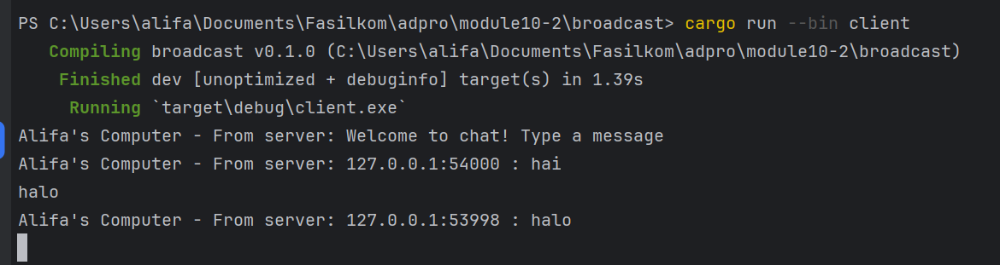
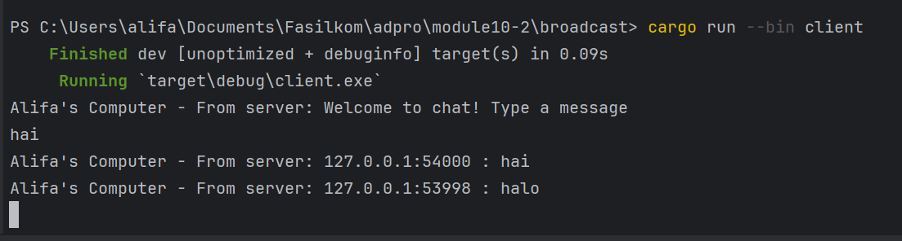

### Server

### Client 1

### Client 2

### Client 3

Untuk menjalankannya, saya menjalankan perintah `cargo run --bin server` untuk menjalankan server. Lalu, saya 
menjalankan perintah `cargo run --bin client` pada 3 terminal yang berbeda untuk menjalankan 3 client. Ketika saya 
mengirimkan sebuah message dari client 1, message tersebut akan di-broadcat oleh server ke client lainnya, begitu juga 
saat saya mengirimkan message dari client lainnya.

### Mengganti port menjadi 8080

Pada file server.rs, kita juga perlu mengganti port websocket menjadi 8080 agar message dari client dapat di-broadcast. 
Port tersebut didefinisikan di function main dan disimpan pada variabel `listener`

### Menambahkan informasi IP pada client
#### Client 1

#### Client 2

Saya mengganti isi teks yang akan di-broadcast pada file server.rs menjadi `bcast_tx.send(format!("{addr} : {text}"))?;`
 untuk memberikan informasi IP asal message tersebut dikirimkan pada client.