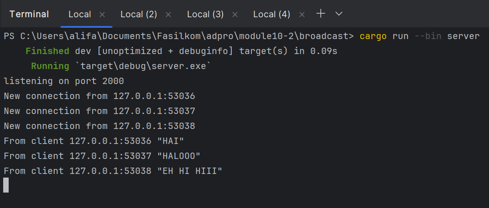
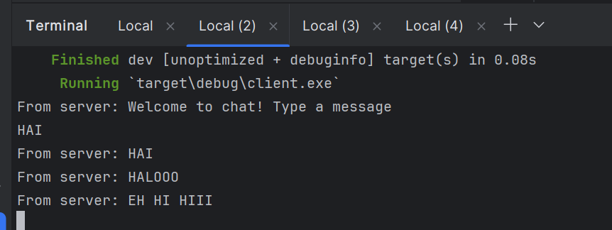
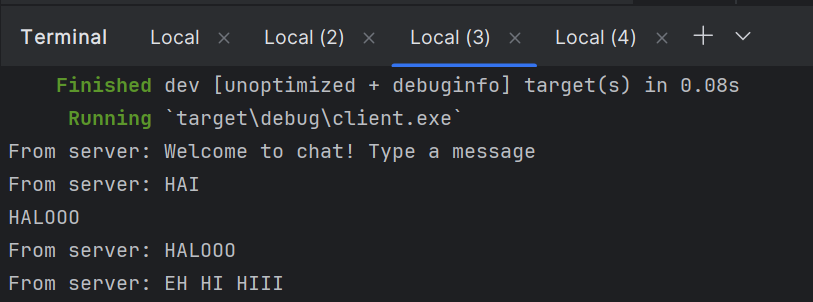
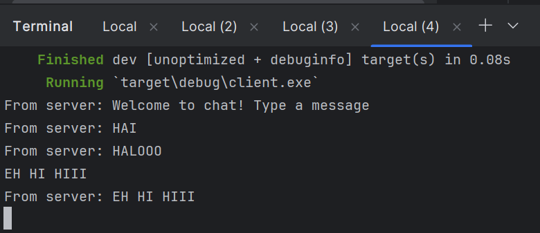

### Server

### Client 1

### Client 2

### Client 3

Untuk menjalankannya, saya menjalankan perintah `cargo run --bin server` untuk menjalankan server. Lalu, saya 
menjalankan perintah `cargo run --bin client` pada 3 terminal yang berbeda untuk menjalankan 3 client. Ketika saya 
mengirimkan sebuah message dari client 1, message tersebut akan di-broadcat oleh server ke client lainnya, begitu juga 
saat saya mengirimkan message dari client lainnya.